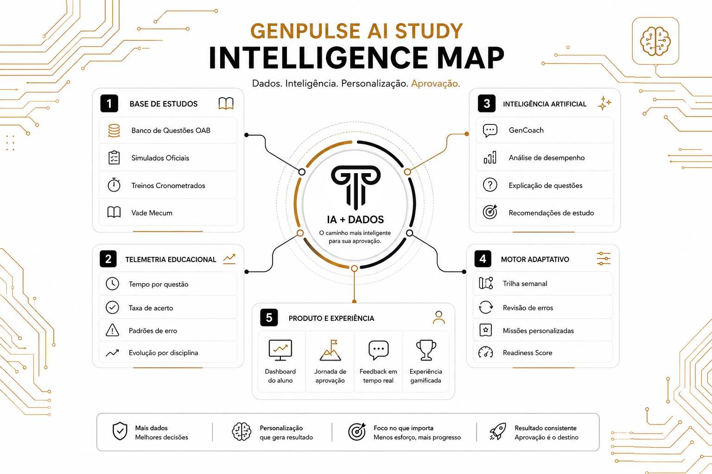

<div align="center">

<p align="center">
  
</p>

# GenPulse

### Behavioral Intelligence & Adaptive AI Platform for OAB Preparation

A web platform that prepares candidates for Brazil's Bar Exam (OAB) by **measuring how
they actually perform** — not just serving questions. **Behavioral Telemetry**
continuously captures learning interactions and transforms them into contextual signals
that power a **Behavioral Intelligence Engine**, personalizing study recommendations and
AI guidance.

**Built for candidates who need a study plan that adapts to how they really learn.**

> **Project Status**
>
> Actively developed and running in production, preparing real candidates for the
> 1st and 2nd phases of the Brazilian Bar Exam.

<br>


**Website:** [genpulse.com.br](https://genpulse.com.br) · **Platform:** [estudante.genpulse.com.br](https://estudante.genpulse.com.br/login)

</div>

---

## Why GenPulse?

Passing the OAB is high-stakes, and most prep tools do the same thing: hand the candidate
an endless pile of questions and a raw percentage at the end. That tells a student
*whether* they got it wrong — never *why*, *where they bleed points*, or *what to study next*.

GenPulse is built around a different premise: the data a candidate generates while
studying is the most valuable signal in their preparation. The platform analyzes learning
behavior and performance patterns to generate adaptive study recommendations — focus areas,
smart reviews, and study trails that evolve over time.

The result is preparation guided by **evidence, not guesswork**.

---

## Main Features

| Feature | What it delivers |
|---|---|
| **Canonical Question Bank** | Every official OAB question stored once and enriched with discipline, topic, normative reference, difficulty, and official commentary — with historical snapshots so past mock exams stay consistent. |
| **Training & Mock Exams** | Free practice, timed practice, official mirror exams, and an intelligent mock generator that balances difficulty against the official OAB matrix. |
| **Adaptive Study Engine** | Per-discipline progress tracking and personalized weekly study trails that adapt as performance evolves. |
| **Behavioral Analytics** | A readiness score and behavioral insights surfaced on a clear performance dashboard that shows where points are being lost. |
| **Phase-Specific AI Coaching** | A conversational AI tutor with dedicated engines for the 1st phase (accuracy & consistency) and 2nd phase (legal drafting & execution). |
| **Adaptive AI Coach** | Guidance grounded in each candidate's real performance data, so coaching reflects their actual progress rather than generic advice. |
| **Multi-Phase Architecture** | A single account with one active phase at a time, with onboarding, diagnostics, telemetry, and AI tailored to each phase of the exam. |
| **Operations & Governance** | Distinct dashboards for students, admins, and super admins, with content governance, report queues, and a configurable registration-approval gate. |

---

## Architecture

A clean, layered design where **dependencies always point inward** — the domain knows
nothing about frameworks, transports, or external services. Each layer depends only on
the one beneath it, so new study modes, evaluators, and integrations plug in without
touching the core (Open/Closed).

```
        ┌──────────────────────────────────────────────────┐
        │                Presentation Layer                │
        │      React SPA (MVVM)   ·   Admin Dashboards       │
        ├──────────────────────────────────────────────────┤
        │                Application Layer                 │
        │   Adaptive Engine · AI Pipeline · Orchestration   │
        ├──────────────────────────────────────────────────┤
        │                   Data Layer                     │
        │   Repositories · Evaluators · External Services   │
        ├──────────────────────────────────────────────────┤
        │                  Domain Layer                    │
        │       Pure models    ·    Business rules          │
        └──────────────────────────────────────────────────┘
                  dependencies point inward — Clean + SOLID
```

On the frontend, every feature follows **MVVM** — a ViewModel holds all logic and state,
while the View stays pure presentation. On the backend, business logic lives in isolated,
single-responsibility modules with zero raw SQL.

---

## Behavioral Intelligence Layer

Behavioral Telemetry powers the Behavioral Intelligence Engine. Rather than reacting only
to correct or incorrect answers, GenPulse continuously **models how each candidate learns**,
transforming raw learning telemetry into high-confidence behavioral insight that drives
adaptive planning and grounded AI reasoning.

The engine works across multiple behavioral and performance dimensions to estimate exam
readiness and surface where points are being lost. Every insight carries a reliability
level, so the system stays conservative when data is thin and only acts with confidence as
evidence accumulates — the specific signals and how they are derived are part of the
platform's proprietary engine.

---

## AI Intelligence Layer

The AI layer is built as a **grounded reasoning pipeline** rather than a thin wrapper
around a language model. Before any response reaches a candidate, it is contextualized
against the platform's curated academic knowledge base and the candidate's own learning
context, then streamed back in real time.

Retrieval-Augmented Generation (RAG) keeps answers anchored to verified educational content
and current legal references, while a dedicated security layer guards against
prompt-injection and jailbreak attempts. The internal composition of the pipeline is
proprietary.

---

## How the AI Reasons

What sets GenPulse apart isn't the language model — it's everything that happens *before*
it. A raw prompt is never forwarded straight to a language model.

Conceptually:

- every interaction a candidate has generates learning data;
- that data feeds the platform's adaptive intelligence;
- the AI draws on that context to produce recommendations tailored to each candidate.

The result is guidance grounded in real evidence rather than generic output — while the
decision logic that connects these steps remains proprietary.

---

## How it Works

From the candidate's side, GenPulse is a simple, repeatable loop:

```
   Diagnose  ──►  Study & Practice  ──►  See Where You Stand  ──►  Follow Your Weekly Plan  ──►  Repeat
```

- **Diagnose** — a short initial assessment reveals strengths and weak spots across disciplines.
- **Study & Practice** — train freely, against the clock, or in full mock exams that mirror the real OAB.
- **See Where You Stand** — a clear dashboard shows readiness and where points are being lost.
- **Follow Your Weekly Plan** — a personalized study trail says exactly what to do next.
- **Repeat** — each week the plan adapts to the candidate's latest progress.

---

## Technology Stack

| Area | Technology |
|---|---|
| Frontend | React 19 · Vite 6 · TypeScript · Tailwind CSS v4 |
| UI | Radix UI · Recharts · Motion |
| Backend | Node.js · REST API · Service Layer |
| Database | PostgreSQL · Vector Search |
| Artificial Intelligence | Behavioral Intelligence · Grounded AI · Retrieval-Augmented Generation (RAG) |
| AI Engineering | Grounded AI Pipeline · Secure AI Engineering |
| Authentication | Token-based auth · Social login |
| Infrastructure | Docker · Nginx · Automated CI/CD |
| Architecture & Principles | Clean Architecture · MVVM · SOLID |
| Security Framework | OWASP Top 10 |

---

## Security

Security is applied at runtime, not bolted on afterward — aligned with the OWASP Top 10:

- **Secure authentication** — token-based authentication with verified accounts.
- **Secure session management** — sessions are renewed and protected transparently.
- **Role-based access control** — authorization enforced down to object-level ownership.
- **Protection against automated abuse** — sensitive flows are shielded from misuse.
- **Modern security headers** — a hardened edge following current best practices.
- **Audit logging** — administrative actions are recorded for traceability.

---

## Screenshots

<div align="center">



_Diagram screen for the GenPulse platform._

</div>

---

## Roadmap

- Deeper behavioral analytics and readiness modeling
- Expanded AI coaching for the 2nd phase (legal drafting and discursive review)
- Continuous calibration of the adaptive engine with real usage data
- Richer mock-exam intelligence and difficulty modeling
- Public documentation site

---

## Repository Philosophy

This repository showcases the platform, its architecture, and the engineering decisions
behind it. The production implementation remains private.

The goal is to present the **product, architecture, and engineering decisions** — clearly
and professionally — without exposing proprietary implementations, internal flows, or
confidential business logic.

<div align="center">

**Built to turn study data into a smarter path to passing the OAB.**

</div>
